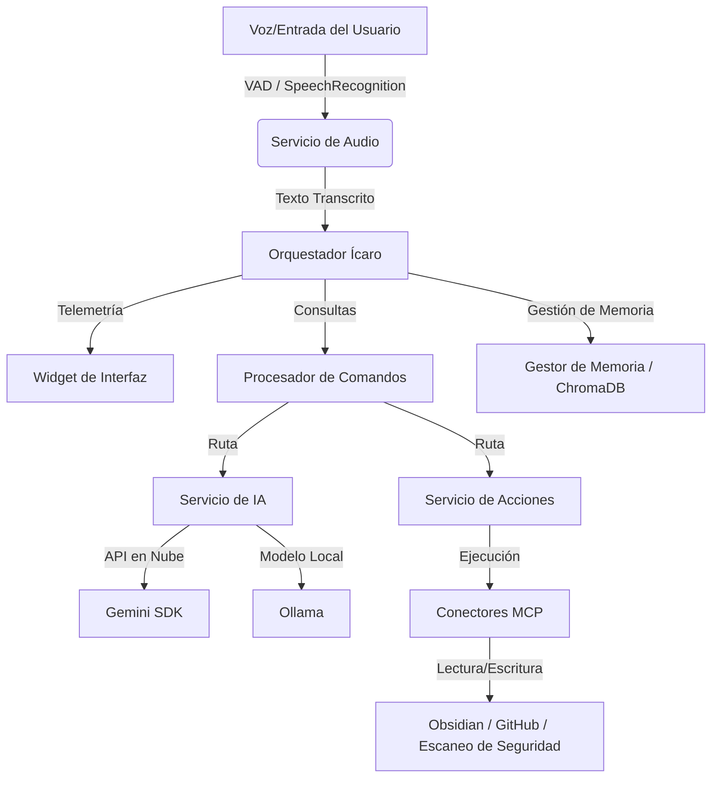

# Ícaro — Asistente de Voz Modular

Idiomas:
- [English (default)](README.md)
- Español: README.es.md

Ícaro es un asistente de IA por voz modular y de última generación diseñado para ejecutarse localmente en Windows (y otras plataformas). Cuenta con una arquitectura robusta basada en máquinas de estado, telemetría en tiempo real, memoria semántica (RAG) potenciada por ChromaDB, ejecución dinámica de comandos y una profunda integración con el **Model Context Protocol (MCP)**.

---

## Características Clave

- **Activación por Voz y VAD**: Escucha la palabra de activación *"Ícaro"* y procesa comandos con detección de actividad de voz (VAD) avanzada usando `webrtcvad` para mantener conversaciones fluidas.
- **Máquina de Estados Formal**: Controlado mediante un diseño de estados explícitos (`INITIALIZING`, `SLEEPING`, `LISTENING`, `THINKING`, `SPEAKING`, `ERROR`) garantizando transiciones confiables y actualizaciones precisas de la interfaz de usuario.
- **Motor de IA Híbrido**: Utiliza LLMs locales mediante **Ollama** (ej. `qwen2.5:1.5b`) para una total privacidad y control offline, o el poder de la nube a través del **SDK oficial de Google Gemini** (`google-genai`).
- **Memoria Semántica (RAG)**: Integra **ChromaDB** con embeddings de `sentence-transformers` para almacenar resúmenes de chats y recuperar detalles contextuales relevantes de sesiones previas de forma automática.
- **Widget de Telemetría en Tiempo Real**: Lanza un panel gráfico ligero en HTML/CSS/JS que refleja de inmediato el estado interno de Ícaro (escuchando, pensando, hablando) y muestra la transcripción dinámica de los comandos.
- **Model Context Protocol (MCP)**: Conectores cliente integrados para interactuar con herramientas externas:
  - **Obsidian**: Consulta y edita notas en tu bóveda personal de Obsidian directamente.
  - **GitHub**: Automatiza tareas y consultas en repositorios de GitHub mediante tokens de API.
  - **Cybersecurity**: Escanea código en busca de vulnerabilidades del OWASP Top 10.
  - **Sequential Thinking**: Desglosa y razona problemas complejos paso a paso.

---

## Arquitectura del Sistema



---

## Requisitos Previos

1. **Python 3.10 - 3.12** instalado en tu sistema.
2. **PortAudio** (requerido para `pyaudio`):
   - **Windows**: PyAudio se instala de forma automática a través de los paquetes precompilados especificados en requirements.txt.
   - **Linux** (Debian/Ubuntu): Ejecuta `sudo apt-get install portaudio19-dev python3-pyaudio`.
   - **macOS**: Ejecuta `brew install portaudio`.
3. **Ollama** (Opcional, para ejecución 100% offline):
   - Descarga e instala [Ollama](https://ollama.com).
   - Descarga el modelo por defecto: `ollama pull qwen2.5:1.5b`.

---

## Instalación

1. **Clonar el Repositorio**:
   ```bash
   git clone https://github.com/4rcher13/Asistente-IA.git
   cd Asistente-IA
   ```

2. **Crear y Activar un Entorno Virtual**:
   - **Windows (PowerShell)**:
     ```powershell
     python -m venv .venv
     .\.venv\Scripts\Activate.ps1
     ```
   - **Linux / macOS**:
     ```bash
     python3 -m venv .venv
     source .venv/bin/activate
     ```

3. **Instalar Dependencias**:
   ```bash
   pip install -r requirements.txt
   ```

---

## Configuración

1. Copia `.env.example` a `.env`:
   ```bash
   cp .env.example .env
   ```

2. Abre `.env` y configura tus variables de entorno:
   - `GEMINI_API_KEY`: Tu clave de API de Google Gemini (opcional, si está vacía usará Ollama).
   - `MODELO_OLLAMA`: Nombre del modelo local en Ollama (por defecto: `qwen2.5:1.5b`).
   - `SECRET_KEY`: Clave criptográfica para firma de sesiones (se autogenera una segura en tiempo de ejecución en desarrollo si no se define).
   - `OBSIDIAN_VAULT_PATH`: Ruta absoluta a tu bóveda personal de Obsidian (opcional).
   - `GITHUB_TOKEN`: Token de acceso personal de GitHub (opcional, para usar GitHub MCP).

---

## Ejecución del Asistente

### Inicio Rápido (Windows)
Haz doble clic en `run.bat` o ejecútalo desde tu terminal para iniciar todo el entorno de forma automática:
1. Levanta el widget HUD visual de telemetría en segundo plano.
2. Inicia el proceso principal de Ícaro en la consola.

```powershell
.\run.bat
```

También puedes usar el script de PowerShell:
```powershell
.\run.ps1
```

### Ejecución Manual
Si deseas iniciar únicamente el asistente por consola (sin el widget de interfaz):
```bash
python -m src.main
```

Argumentos de línea de comandos disponibles:
- `--debug`: Activa el nivel de registros `DEBUG` en consola.
- `--silent`: Desactiva la locución del saludo por voz al iniciar.
- `--no-ai`: Desactiva los servicios de IA (Gemini/Ollama), procesando solo comandos locales.

---

## Estructura del Proyecto

```
├── src/
│   ├── main.py              # Punto de entrada principal
│   ├── config/              # Gestión de variables y validación de entornos
│   ├── core/                # Núcleo (Máquina de estados, Memoria, Procesador de Comandos, Plugins)
│   ├── mcps/                # Capa de integración del Model Context Protocol
│   ├── services/            # Servicios de audio, clientes de IA y controladores de acciones
│   ├── utils/               # Funciones de utilidad y normalización de textos
├── ui/
│   ├── widget.py            # Script del widget HUD de telemetría
│   └── widget.html/js/css   # Plantilla, estilos e interactividad de la interfaz
├── tests/                   # Pruebas unitarias y de integración
├── requirements.txt         # Dependencias de Python
└── security_scan.ps1        # Script PowerShell de auditoría de seguridad
```

---

## Pruebas y Control de Calidad

### Ejecutar Pruebas Unitarias e Integración
```bash
python -Xutf8 -m pytest tests/ -v --tb=short
```

O usa el script de conveniencia:
```powershell
.\run_tests.ps1 all
```

### Ejecutar Escaneo de Seguridad
Para buscar posibles filtraciones de secretos, vectores de inyección SQL o malas prácticas:
```powershell
.\security_scan.ps1
```

---

## Licencia

Este proyecto está bajo la Licencia MIT. Consulta [LICENSE](LICENSE) para más detalles.
