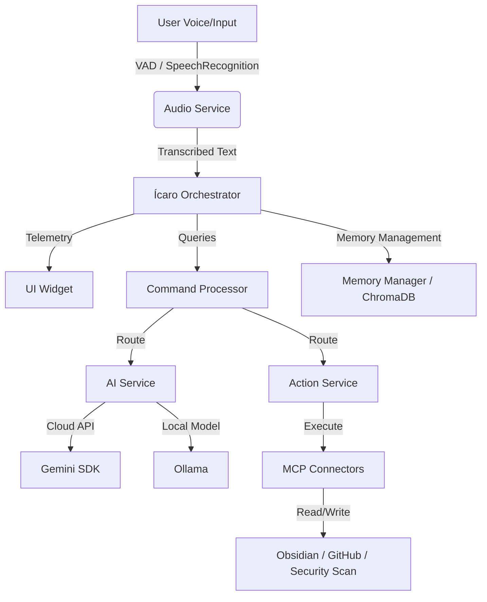

# Ícaro — Modular Voice Assistant

Languages:
- English (default)
- Español: [README.es.md](README.es.md)

Ícaro is a state-of-the-art, modular, voice-activated AI assistant designed to run locally on Windows (and other platforms). It features a robust state-machine architecture, real-time telemetry, semantic memory (RAG) powered by ChromaDB, dynamic command execution, and deep integration with the **Model Context Protocol (MCP)**.

---

## Key Features

- **Voice-Activated & VAD-Driven**: Listens for the wake word *"Ícaro"* and processes commands with advanced Voice Activity Detection (VAD) using `webrtcvad` for smooth conversations.
- **State-Machine Architecture**: Managed via a formal state machine (`INITIALIZING`, `SLEEPING`, `LISTENING`, `THINKING`, `SPEAKING`, `ERROR`) to ensure reliable state transitions and UI updates.
- **Hybrid AI Engine**: Leverages local LLMs via **Ollama** (e.g., `qwen2.5:1.5b`) for complete privacy and offline control, or cloud power via the official **Google Gemini SDK** (`google-genai`).
- **Semantic Memory (RAG)**: Integrates **ChromaDB** with sentence-transformer embeddings to store chat summaries and recall contextual details from previous sessions.
- **Real-Time Telemetry Overlay**: Launches a lightweight HTML/CSS/JS status widget that reflects Ícaro's internal state (listening, thinking, speaking) and displays transcripts dynamically.
- **Model Context Protocol (MCP)**: Custom MCP clients for rich third-party tool connectivity:
  - **Obsidian**: Interface directly with your Obsidian vault to read/write notes.
  - **GitHub**: Automate repository interactions using secure API tokens.
  - **Cybersecurity**: Scan code for OWASP Top 10 vulnerabilities.
  - **Sequential Thinking**: Break complex reasoning tasks down step-by-step.

---

## System Architecture



---

## Prerequisites

1. **Python 3.10 - 3.12** installed on your system.
2. **PortAudio** (required for `pyaudio`):
   - **Windows**: PyAudio is installed via pre-built wheels in python requirements automatically.
   - **Linux** (Debian/Ubuntu): Run `sudo apt-get install portaudio19-dev python3-pyaudio`.
   - **macOS**: Run `brew install portaudio`.
3. **Ollama** (Optional, for offline local models):
   - Download and install [Ollama](https://ollama.com).
   - Pull the default model: `ollama pull qwen2.5:1.5b`.

---

## Installation

1. **Clone the Repository**:
   ```bash
   git clone https://github.com/4rcher13/Asistente-IA.git
   cd Asistente-IA
   ```

2. **Create and Activate a Virtual Environment**:
   - **Windows (PowerShell)**:
     ```powershell
     python -m venv .venv
     .\.venv\Scripts\Activate.ps1
     ```
   - **Linux / macOS**:
     ```bash
     python3 -m venv .venv
     source .venv/bin/activate
     ```

3. **Install Dependencies**:
   ```bash
   pip install -r requirements.txt
   ```

---

## Configuration

1. Copy `.env.example` to `.env`:
   ```bash
   cp .env.example .env
   ```

2. Open `.env` and fill in the required variables:
   - `GEMINI_API_KEY`: Your Google Gemini API key (optional, falls back to Ollama if empty).
   - `MODELO_OLLAMA`: Ollama model to use (default: `qwen2.5:1.5b`).
   - `SECRET_KEY`: Private cryptographic key for session verification (automatically generated dynamically in development if left empty).
   - `OBSIDIAN_VAULT_PATH`: Path to your personal Obsidian Vault directory (optional).
   - `GITHUB_TOKEN`: GitHub Personal Access Token (optional, for GitHub MCP).

---

##  Running the Assistant

### Quick Start (Windows)
Double-click `run.bat` or execute it in your terminal. This will:
1. Spin up the visual UI status widget overlay in the background.
2. Launch Ícaro in your console.

```powershell
.\run.bat
```

Alternatively, you can run the PowerShell script:
```powershell
.\run.ps1
```

### Manual Launch
To start the assistant directly without the widget:
```bash
python -m src.main
```

Available CLI Arguments:
- `--debug`: Activates `DEBUG` level logs in the console.
- `--silent`: Disables startup voice greeting.
- `--no-ai`: Disables all AI services, processing only local hardcoded commands.

---

## Project Structure

```
├── src/
│   ├── main.py              # Main execution entrypoint
│   ├── config/              # Configuration & system settings loaders
│   ├── core/                # Core engine (State machine, Memory, Command Processor, Plugins)
│   ├── mcps/                # Model Context Protocol integration layers
│   ├── services/            # Audio capture/synthesis, AI clients, Action controllers
│   ├── utils/               # Text normalization and utility functions
├── ui/
│   ├── widget.py            # Desktop HUD telemetry widget
│   └── widget.html/js/css   # UI web view templates
├── tests/                   # Unit and integration test suites
├── requirements.txt         # Project dependencies
└── security_scan.ps1        # Security assessment script
```

---

## Testing & Quality Assurance

### Run Unit and Integration Tests
```bash
python -Xutf8 -m pytest tests/ -v --tb=short
```

Or use the helper script:
```powershell
.\run_tests.ps1 all
```

### Run Security Vulnerability Scanning
To inspect the codebase for secrets leak, SQL injection vectors, or insecure code patterns:
```powershell
.\security_scan.ps1
```

---

## License

This project is licensed under the MIT License. See [LICENSE](LICENSE) for details.
